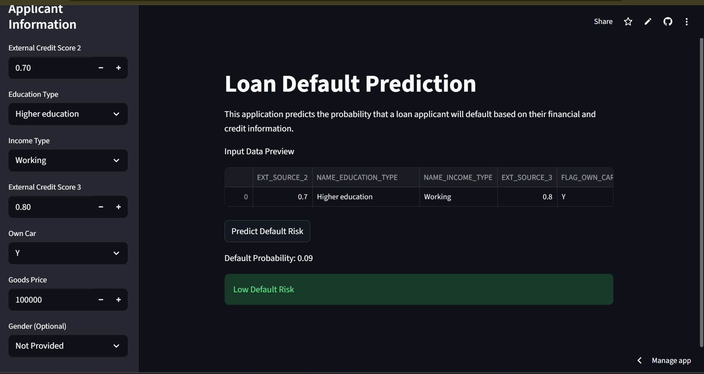
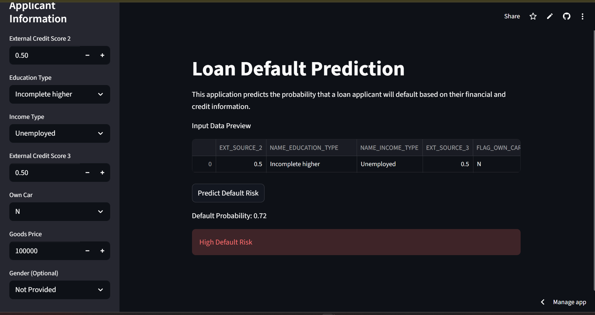
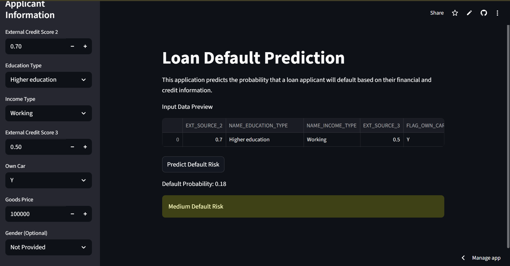

# 📊 Loan Default Prediction (XGBoost + Streamlit)

An **end-to-end Machine Learning project** that predicts the **probability of loan default** using applicant financial and demographic information.  
The project covers **data preprocessing, model training, evaluation, and deployment** with a clean Streamlit interface.

---

## 🚀 Live Demo
🔗 **Streamlit App**  
https://prince-loan-default-prediction.streamlit.app/

---

## 🖥️ Application Screenshots
### 1️⃣ Low Loan Default


### 2️⃣ High Loan Default


### 3️⃣ Median Loan Default

---
## 🧠 Problem Statement
Loan default prediction is a critical task for financial institutions.  
The goal is to **identify high-risk applicants early** to minimize financial losses.

This is a **highly imbalanced classification problem**, where:
- Default cases are rare
- Missing a defaulter (false negative) is more costly than rejecting a safe applicant

---

## 🛠️ Tech Stack
- Python
- NumPy, Pandas
- Scikit-learn
- XGBoost
- Streamlit
- Joblib

---

## 📂 Project Structure
```
loan-default-prediction/
│
├── app.py
├── loan_default_model_training.ipynb
├── xgboost_credit_risk_pipeline_final.joblib
├── requirements.txt
├── runtime.txt
├── README.md
└── .gitignore
``` 

---

## 📊 Model & Approach
- **Algorithm**: XGBoost Classifier  
- **Preprocessing**:
  - Missing value imputation
  - One-hot encoding for categorical features
  - Feature scaling
  - All steps wrapped inside a single `Pipeline`
- **Class Imbalance Handling**:
  - `scale_pos_weight`
  - ROC–AUC based model selection
- **Threshold Optimization**:
  - Default threshold (0.5) rejected
  - Business-driven thresholds (0.1, 0.2)

---

## 📈 Evaluation Metrics
- ROC–AUC (primary metric)
- Precision–Recall trade-off
- Risk-based classification:
  - Low Risk
  - Medium Risk
  - High Risk

---


## 🧪 How to Run Locally

### 1️⃣ Clone the repository
```bash
git clone https://github.com/Prince2409shah/loan-default-prediciton-plan.git
cd loan-default-prediciton-plan
```
### 1️⃣ Clone the repository
```bash
git clone https://github.com/Prince2409shah/loan-default-prediciton-plan.git
cd loan-default-prediciton-plan
```
### 2️⃣ Create & activate virtual environment
```bash
python -m venv venv
venv\Scripts\activate   # Windows
```
### 3️⃣ Install dependencies
```bash
pip install -r requirements.txt
```
### 4️⃣ Run the Streamlit app
```bash
streamlit run app.py
```
## 📦 Dataset
- The dataset is not included in this repository due to GitHub size limits.
- Source: Kaggle – Home Credit Default Risk
- File used: application_train.csv 
--- 
## 🎯 Key Learnings

- Handling imbalanced classification problems
- Importance of threshold tuning over accuracy
- End-to-end ML pipeline design
- Production-safe deployment using Streamlit
- Dependency and Python version management
---
🎯 Key Learnings

- Handling imbalanced classification problems
- Importance of threshold tuning over accuracy
- End-to-end ML pipeline design
- Production-safe deployment using Streamlit
- Dependency and Python version management
--- 
## 👤 Author
Prince Shah
Aspiring Machine Learning Engineer
🔗 GitHub: https://github.com/Prince2409shah 
---